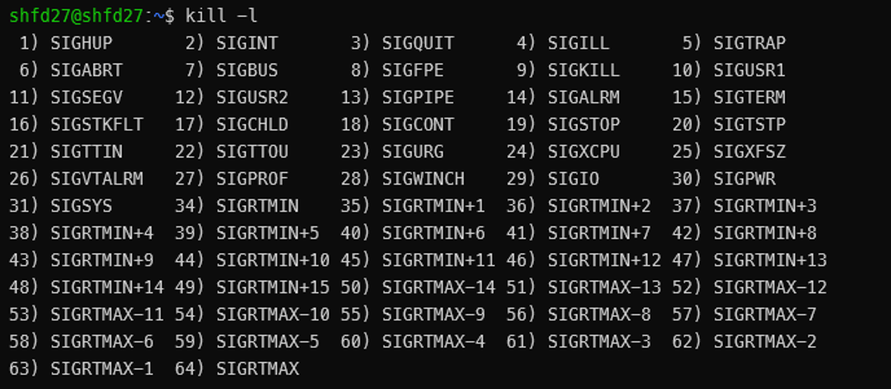
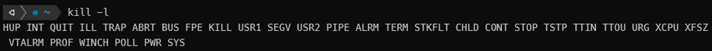
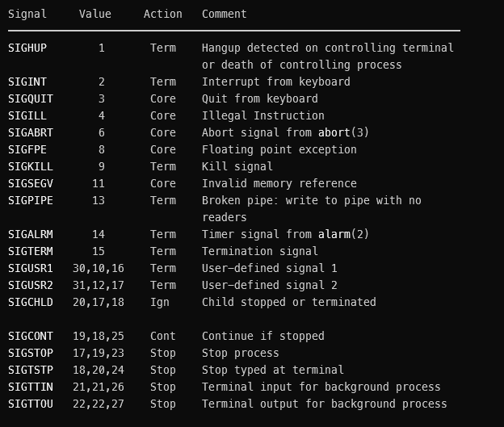

# Command-Line Environment  

## SIGNAL  

잘못된 명령을 내렸거나 명령을 내렸을때 오래걸린면?  
🠒프로세스 종료 필요  
windows같은 운영체제에서는 프로세스 관리자를 통해 kill 가능      
shell에서는 SIGNAL 보내야됨  


### SIGNAL 종류 확인법  
`kill -l`  


  
Ubuntu  
  
Ubuntu WSL  
(운영체제따라 다를 수 있음)  


`man 7 signal` 을 치면 각 SIGNAL에 대한 설명을 볼 수 있음  
  


### signal handler  

signal 함수로 SIGNAL을 무시하거나 다른 동작을 할수있게 처리 할수 있음  

ex) SIGINT 무시  
```
#!/usr/bin/env python
import signal, time

def handler(signum, time):
    print("\nI got a SIGINT, but I am not stopping")

signal.signal(signal.SIGINT, handler)
i = 0
while True:
    time.sleep(.1)
    print("\r{}".format(i), end="")
    i += 1
```
python 코드 (from [mit missing semester](https://missing.csail.mit.edu/2020/command-line/))  

SIGQUIT (ctrl-\\) 으로 프로그램을 종료하거나 SIGSTOP(ctrl-z)으로 일시정지할 수 있음  

※참고로 WSL에서는 SIGQUIT (ctrl-\\) 불가
<sup>[[1]](https://github.com/microsoft/WSL/issues/169)
[[2]](https://github.com/microsoft/WSL/issues/4715)</sup>  

### signal key combinations  

`ctrl+c` : SIGINT  
`ctrl+z` : SIGSTP  
`ctrl+\\` : SIGQUIT  
`ctrl+s` : SIGSTOP  
`ctrl+q` : SIGCONT  

## tmux  

## alias  

## port forwarding  